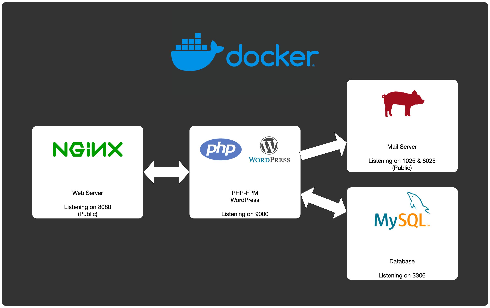
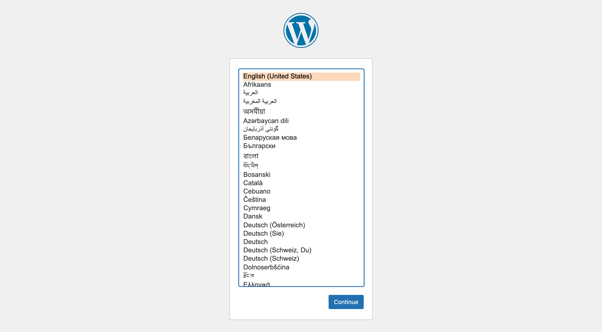
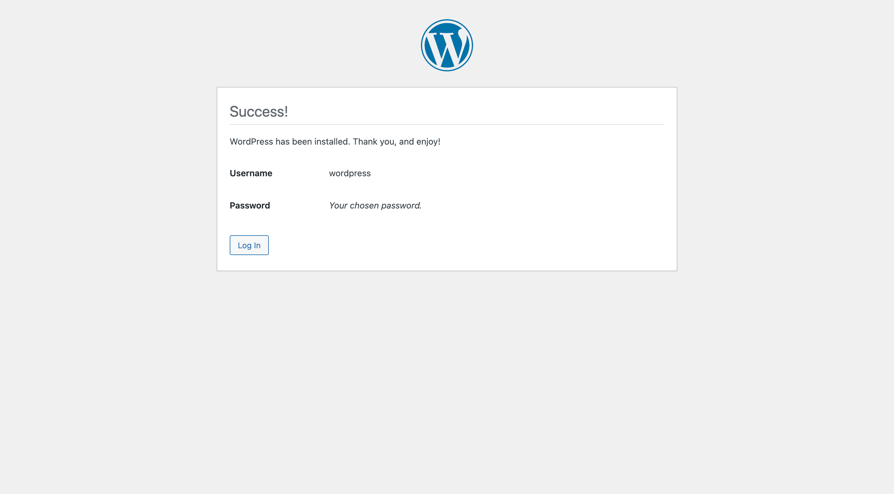
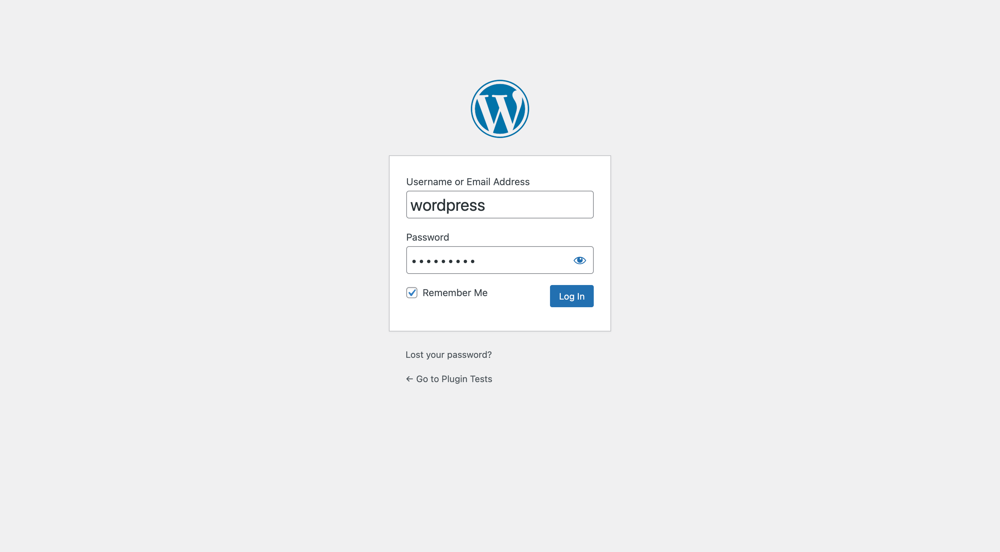
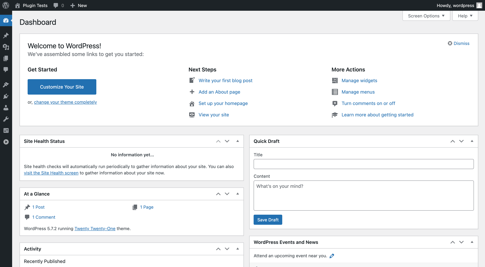
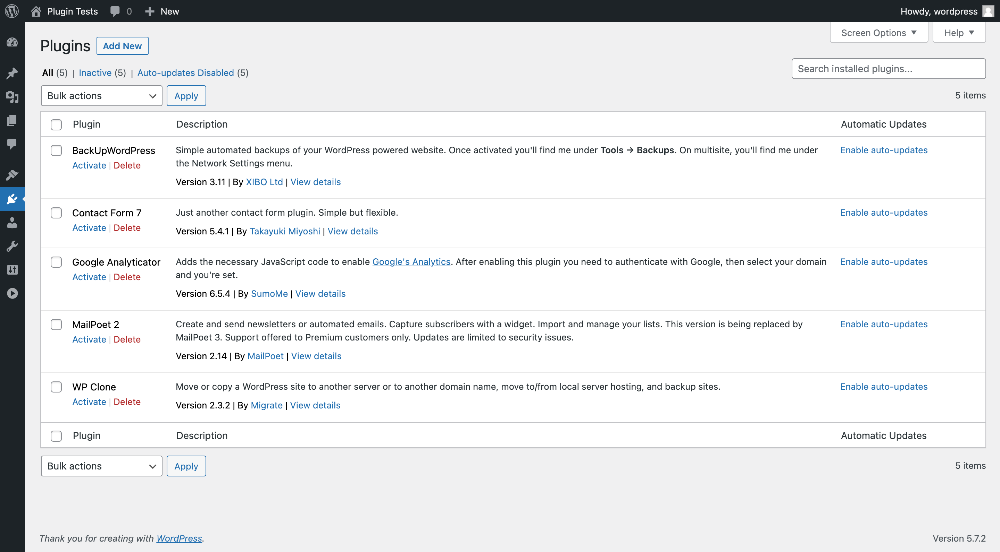
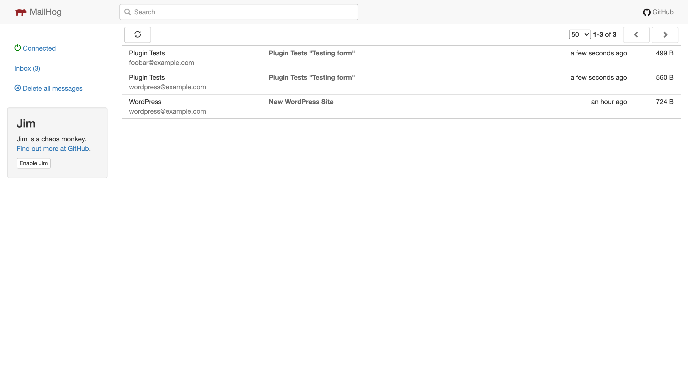
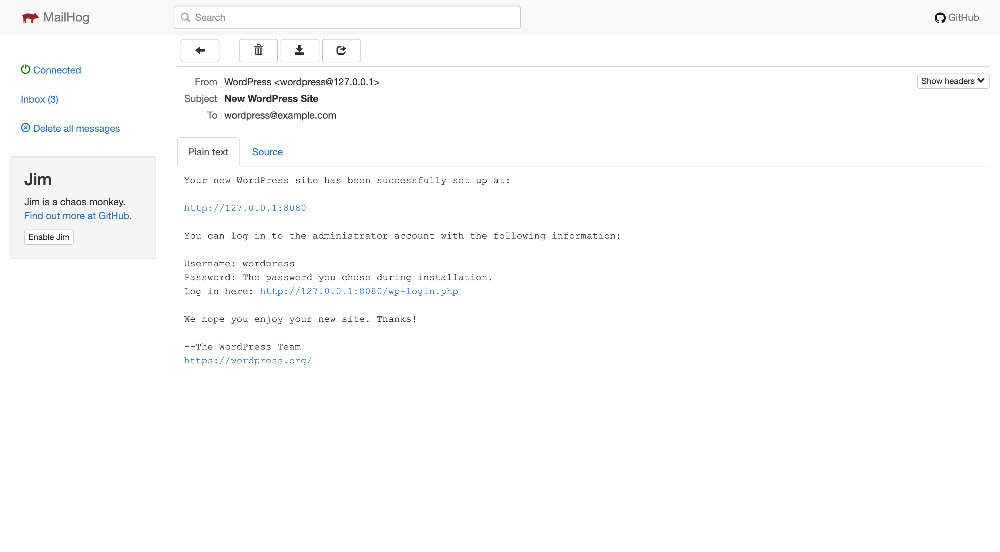

# WordPress Test Environment

For testing [WordPress] plugins, I needed a flexible environment that would work in most cases.

That is why I have set up this [Docker] environment which allows me to test and verify these plugins. My primary focus is to see and verify how personal information is handled by a particular plugin.

## Architecture

To get started quickly, I'm using an immutable environment with a frontend web server, the PHP backend server that hosts WordPress, a backend database server only accessible by the PHP server and a mail server that catches all emails and displays it in a browser window.

## Requirements

The only requirement is to have [Docker] installed on your workstation. Please follow the [Docker Desktop installation instructions](https://www.docker.com/products/docker-desktop) to have it yourself.

In directory `plugins` you can drop the plugins you want to review. This saves you from downloading them within the container.

## Getting started

On the command line, you can fire up the WordPress container with `docker compose up`. It will pull the required images from Docker Hub, builds the PHP and Nginx containers and starts all containers in one single go.

Once running, point your browser to <http://127.0.0.1:8080> and you will be greeted with a language selection screen.

Choose your preferred language and click on "Continue".

The next step is to give some details about the website, where I use the following details:

- site name: Plugin Tests
- username: wordpress
- password: wordpress
- confirm weak passwords: yes
- email address: wordpress@example.com

You may want to change these settings to your likings, as this site runs inside an enclosed environment. Click on "Install WordPress" to continue.

Since WordPress was already configured, you'll get a success page to inform you that everything is set up and ready for you to use.

Click on the button "Log in" to sign in as administrator using the credentials you provided during the site setup.

Once you're logged in, the WordPress dashboard is displayed. This is where you can manage the whole of the site.

If you go to the plugins overview, you will find all the plugins you have added to the `plugins` directory.

Here you can activate and configure the plugin you want to test.

**ADVICE:** Test one plugin at a time to ensure your analysis is correct.

## Mail handling

This setup provides you with a catch all email service that can display all emails being sent by a plugin.

Point your browser to <http://127.0.0.1:8025/> to see the mail in- and outbox. This is convenient if you want to see if personal information is shared with the outside world.

And when you click an entry you will see the details of that email.

Happy testing!!!

[WordPress]: https://www.wordpress.org/
[Docker]: https://www.docker.com/